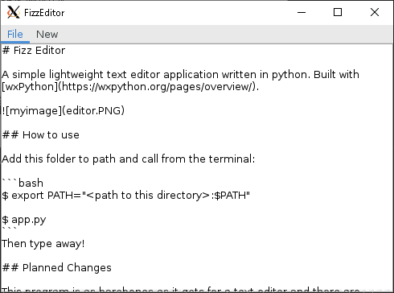

# Fizz Editor

A simple lightweight text editor application written in python. Built with [wxPython](https://wxpython.org/pages/overview/).



## How to use

Add this folder to path and call from the terminal:

```bash
$ export PATH="<path to this directory>:$PATH"

$ app.py
```
Then type away!

## Planned Changes

This program is as barebones as it gets for a text editor and there are plans to add several fun features that will be outlined in the coming days here!